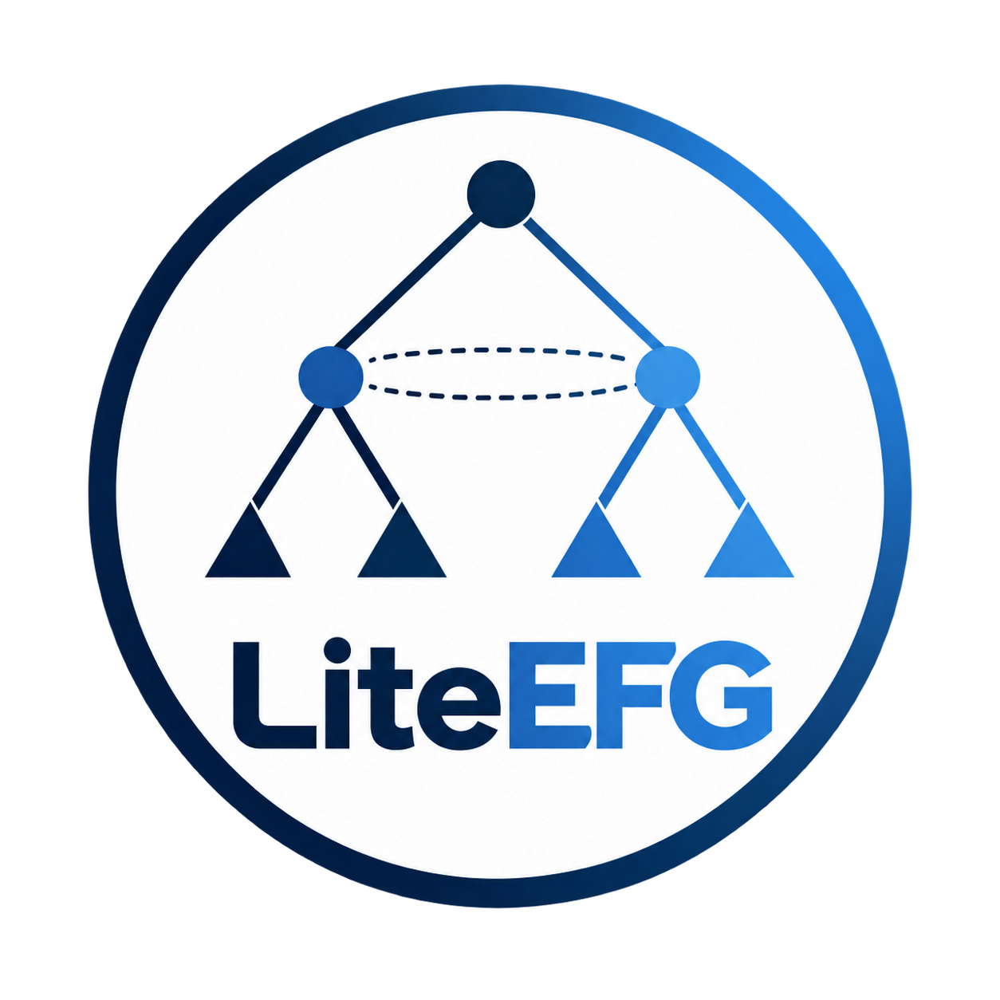

## Features

- **Deep Reinforcement Learning (DRL) support** — Train neural game-solving algorithms with JAX, including [Proximal Policy Optimization (PPO)](https://liumy2010.github.io/LiteEFG/guide/deep-learning/baselines/ppo.html).
- **Custom C++ environments** — Implement your own games with [`CppEnv`](https://liumy2010.github.io/LiteEFG/guide/environments/cpp-env.html).
- **Parallel acceleration** — Use [native C++ threads](https://liumy2010.github.io/LiteEFG/guide/computation-graph.html#parallel-execution) and [multi-device DRL execution](https://liumy2010.github.io/LiteEFG/guide/deep-learning/scaling.html#choose-devices-and-stages).
- **Documentation** — Explore the [guides, examples, and interface reference](https://liumy2010.github.io/LiteEFG/).

---

<p align="center">
  
</p>

<h1 align="center">LiteEFG</h1>

<p align="center">
  <strong>Game-solving algorithms.</strong><br>
  A Python interface backed by C++ and JAX for solving extensive-form games.
</p>

<p align="center">
  <a href="https://liumy2010.github.io/LiteEFG/"></a>
  <a href="https://arxiv.org/abs/2407.20351"></a>
  <a href="LICENSE"></a>
</p>

<p align="center">
  <a href="https://liumy2010.github.io/LiteEFG/"><strong>Documentation</strong></a> ·
  <a href="https://liumy2010.github.io/LiteEFG/guide/quick-start.html">Quick start</a> ·
  <a href="https://liumy2010.github.io/LiteEFG/guide/algorithms.html">Algorithms</a> ·
  <a href="https://liumy2010.github.io/LiteEFG/guide/deep-learning.html">Deep learning</a> ·
  <a href="https://arxiv.org/abs/2407.20351">Paper</a>
</p>

Define an algorithm’s update rule in Python for a single information set. LiteEFG evaluates the resulting computation graph throughout the game, maintaining separate values at each information set. Start with a baseline implementation, connect an OpenSpiel game, or bring your own environment.

## Installation

Use Python 3.10 or newer. The default installation includes tabular solvers and DRL support with JAX, Optax, and Flax:

```sh
python -m pip install LiteEFG
```

Then run your first solver with the [Counterfactual Regret Minimization (CFR) on Kuhn poker quick start](https://liumy2010.github.io/LiteEFG/guide/quick-start.html). For dependencies and graphics processing unit (GPU) setup, see the [installation guide](https://liumy2010.github.io/LiteEFG/guide/installation.html).

<details>
<summary><strong>Build from source</strong></summary>

Use Python 3.10 or newer and a compiler with C++17 support, and clone with the pybind11 submodule. Installing from source also includes JAX, Optax, and Flax:

```sh
git clone --recursive https://github.com/liumy2010/LiteEFG.git
cd LiteEFG
python -m pip install .
```

</details>

## Documentation

| Explore | Resources |
| --- | --- |
| Learn the model | [Core concepts](https://liumy2010.github.io/LiteEFG/guide/concepts.html) · [Computation graphs](https://liumy2010.github.io/LiteEFG/guide/computation-graph.html) |
| Choose an algorithm | [Baselines](https://liumy2010.github.io/LiteEFG/guide/algorithms.html) · [Examples](https://liumy2010.github.io/LiteEFG/guide/examples.html) |
| Construct a game | [Environments](https://liumy2010.github.io/LiteEFG/guide/environments.html) · [Custom C++ games](https://liumy2010.github.io/LiteEFG/guide/environments/cpp-env.html) |
| Train neural policies | [DRL quick start](https://liumy2010.github.io/LiteEFG/guide/deep-learning.html) · [DRL baselines](https://liumy2010.github.io/LiteEFG/guide/deep-learning/baselines.html) · [JAX and GPU setup](https://liumy2010.github.io/LiteEFG/guide/installation.html#deep-learning-with-jax) |
| Run experiments | [Parallel execution](https://liumy2010.github.io/LiteEFG/guide/computation-graph.html#parallel-execution) · [Save and resume](https://liumy2010.github.io/LiteEFG/guide/examples.html#save-and-resume-training) |
| Look up an application programming interface (API) | [Graph API](https://liumy2010.github.io/LiteEFG/guide/computation-graph.html#api-reference) · [Environment API](https://liumy2010.github.io/LiteEFG/guide/environments.html#api-reference) |
| Cite LiteEFG | [Paper and citation](https://liumy2010.github.io/LiteEFG/research.html) |

<details>
<summary><strong>Preview the documentation locally</strong></summary>

The source is in [`docs/`](docs/index.md). Use Node.js 22.12+ and npm from the repository root:

```sh
npm ci
npm run docs:dev
```

Open [localhost:5173/LiteEFG/](http://localhost:5173/LiteEFG/). The documentation build does not compile or install LiteEFG. See [contributing to the docs](docs/contributing.md) for production checks and GitHub Pages setup.

</details>

## Citing LiteEFG

If you use LiteEFG in your research, please cite:

```bibtex
@article{liu2024liteefgefficientpythonlibrary,
  title={{LiteEFG}: An Efficient Python Library for Solving Extensive-form Games},
  author={Mingyang Liu and Gabriele Farina and Asuman Ozdaglar},
  year={2024},
  eprint={2407.20351},
  archivePrefix={arXiv},
  primaryClass={cs.GT},
  url={https://arxiv.org/abs/2407.20351}
}
```

## License

LiteEFG is released under the [MIT license](LICENSE).
