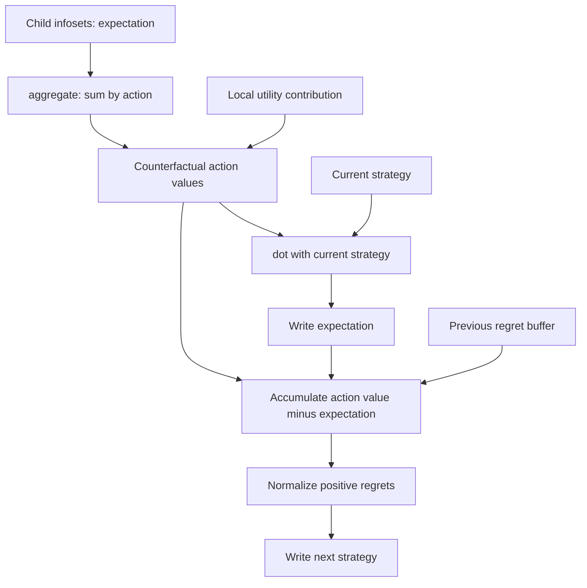

# Writing a computation graph

A LiteEFG graph describes the update rule at one information set. The environment executes that rule at the relevant infosets, with a separate set of vector values at each one. Python builds the rule; C++ traverses the game and evaluates it.

Start with the [quick start](./quick-start.md) to run Counterfactual Regret Minimization (CFR). This page explains the graph behind that example and how to adapt the pattern.

## Read the CFR graph

The central part of [`LiteEFG/baselines/CFR.py`](https://github.com/liumy2010/LiteEFG/blob/main/LiteEFG/baselines/CFR.py) is small enough to read in full:

```python
import LiteEFG as leg
from LiteEFG.baselines.baseline import _baseline

class graph(_baseline):
    def __init__(self):
        super().__init__()

        with leg.backward(is_static=True):
            expectation = leg.const(size=1, val=0.0)
            self.strategy = leg.const(self.action_set_size, 1.0 / self.action_set_size)
            self.regret_buffer = leg.const(self.action_set_size, 0.0)

        with leg.backward():
            counterfactual_value = leg.aggregate(expectation, aggregator="sum") + self.utility
            expectation.inplace(leg.dot(counterfactual_value, self.strategy))
            self.regret_buffer.inplace(self.regret_buffer + counterfactual_value - expectation)
            self.strategy.inplace(leg.normalize(self.regret_buffer, p_norm=1.0, ignore_negative=True))
```

This is an excerpt; `_baseline` is the repository's small abstract subclass of `leg.Graph`. The CFR class also implements `update_graph(env)` by calling `env.update(self.strategy)`, and its `current_strategy()` returns `self.strategy`.

The static block creates one scalar expected value and two action-sized vectors at every infoset. The dynamic block then performs four steps:

1. Sum continuation values from child infosets and add the environment's local utility contribution.
2. Take the dot product with the current strategy to compute the infoset's expected value.
3. Add each action's advantage over that expected value to cumulative regret.
4. Normalize positive regrets into the next strategy. If all positive regrets vanish, the result is uniform.



The backward pass makes each child's newly computed `expectation` available to its parent. The environment's `utility` alone is not the entire counterfactual action value: the aggregation supplies continuation values.

## Choose an execution phase

Use `leg.backward(is_static=False, color=0)` or `leg.forward(is_static=False, color=0)` around graph construction.

| Phase | When it runs | Useful for |
| --- | --- | --- |
| Static backward | Once when `env.set_graph(graph)` runs, from descendants toward ancestors | Initial vectors and quantities computed from subtrees |
| Static forward | After static backward, from ancestors toward descendants | Depth and quantities inherited from parents |
| Backward | First during each update, in reverse traversal order | Continuation values, regrets, and bottom-up updates |
| Forward | After backward, in traversal order | Passing updated quantities down the game |

Within a phase at an infoset, operations execute in the order they were created. The selected traversal determines which infosets receive dynamic updates; see [environments](./environments.md).

Static state remains available between updates. Here, `regret_buffer` is initialized once but the dynamic block writes new values into it on every update.

::: tip Construction discipline
Call `super().__init__()` before creating graph nodes in a subclass constructor.
Build the complete graph before attaching it with `env.set_graph(graph)`;
do not add operations in the training loop.
:::

## Parallel execution

With `import LiteEFG as leg`, call `leg.set_threads(4)` to use four native
computation threads. The default is one thread, and the count includes the
calling thread. `leg.get_threads()` returns the configured count. Set it before
`env.set_graph(graph)`.

Aggregation order and the random stream are preserved across thread counts.
Static initialization and game-tree traversal run serially. Updates with
opponent aggregation, non-tree own-player dependencies, or random dimensions
computed during the current pass also run serially. Small or narrow layers can
be slower with multiple threads.

## Update storage with `inplace`

A `GraphNode` identifies a vector slot and the operations that use it. Ordinary Python assignment changes a Python reference. `target.inplace(expression)` instead redirects the expression's output to the target's existing vector slot when the graph executes.

```python
# Inside a dynamic graph-construction block:
self.regret_buffer.inplace(self.regret_buffer + advantage)
```

`inplace` returns `None`; do not assign its return value. Keep using the target after this operation, because the expression's original output slot is no longer where the result is written.

Use `copy()` to create a new copy operation when assigning from an existing node:

```python
# Inside a dynamic block, with a and b initialized as scalar nodes:
next_value = a + b
a.inplace(b.copy())
b.inplace(next_value.copy())
```

This records a Fibonacci-style update: compute the sum before changing either input, then copy the old `b` into `a` and the sum into `b`. In contrast, `a.inplace(b)` redirects the operation that originally produced `b`; it does not insert a new copy at this point in the execution order.

## Move values between infosets

Most operations are local to an infoset. `leg.aggregate` reads related infosets through the game's sequence structure.

For the default `object="children", player="self"`, children are the next infosets of the same player reached after an action. Intervening chance or opponent decisions do not become extra steps in that player's infoset tree. The operation concatenates the source vectors from those child infosets, reduces them, and returns one scalar for each current action. When an action has no child infoset, it returns `padding`, which defaults to zero.

```python
continuation = leg.aggregate(expectation, aggregator="sum")
```

For `object="parent"`, a scalar source is passed down unchanged; an action-sized source contributes the component for the action leading to the current infoset. A forward block lets descendants read values computed earlier at their parents. [`Balanced_OMD.py`](https://github.com/liumy2010/LiteEFG/blob/main/LiteEFG/baselines/Balanced_OMD.py) uses this to initialize depth inside its graph constructor, after `super().__init__()`:

```python
with leg.forward(is_static=True):
    self.depth = leg.const(size=1, val=1.0)
    self.depth.inplace(leg.aggregate(self.depth, "max", object="parent", player="self", padding=0) + 1.0)
```

`player="opponents"` selects relationships to other players' infosets. The [Q-Function based Regret Minimization (QFR) baseline](https://github.com/liumy2010/LiteEFG/blob/main/LiteEFG/baselines/QFR.py) demonstrates this more advanced use. The [aggregation reference](#aggregate) lists supported reductions and current limitations.

## Schedule groups of operations with colors

The `color` argument labels the operations created in a phase block. Pass `upd_color` to `env.update` to choose which labels execute. It selects operations; it does not change their dependencies or automatically run skipped prerequisite operations.

[Clairvoyant Mirror Descent (CMD)](https://github.com/liumy2010/LiteEFG/blob/main/LiteEFG/baselines/CMD.py) places its main update in color `0` and its reference-strategy copy in color `1`:

```python
with leg.backward(color=1):
    self.bar_u.inplace(self.u.copy())
```

Its update method refreshes that reference once per group of inner iterations:

```python
def update_graph(self, env: leg.Environment) -> None:
    self.timestep += 1
    if self.timestep % self.inner_epoch == 0:
        env.update(self.u, upd_color=[0, 1])
    else:
        env.update(self.u, upd_color=[0])
```

The default `upd_color=[-1]` runs all colors. Choose explicit colors when an algorithm needs several update schedules over shared state, and inspect that state through [`env.get_value`](environments.md#api-reference).

See the [graph application programming interface (API) reference](#api-reference) for all bound operators, shapes, and numerical details.

## API reference

Import the public API with `import LiteEFG as leg`. Operations in this reference build `GraphNode` expressions; numerical values live in an attached environment. Read them with [`env.get_value(player, node)`](environments.md#api-reference).

This reference covers tabular graphs. For neural algorithms, see
[DRLGraph objectives](deep-learning/objectives.md).

Use positional arguments for operands shown as `x` and `y`.

### `Graph`

```python
leg.Graph()
```

Subclass `Graph` and call `super().__init__()` before creating nodes. Its five read-only attributes are themselves graph nodes, with values supplied separately at every infoset:

| Attribute | Shape | Meaning |
| --- | --- | --- |
| `action_set_size` | Scalar | Number of actions at the infoset |
| `utility` | One entry per action | Local payoff contribution supplied by the traversal; aggregate continuation values separately |
| `reach_prob` | Scalar | Reach probability contributed by the player who owns the infoset |
| `opponent_reach_prob` | Scalar | Sum of chance-and-opponent reach contributions at visited game states in the infoset |
| `subtree_size` | One entry per action | Structural subtree statistic described below |

Under `Enumerate`, local utility contributions are weighted by chance and other players' reach. Sampling traversals populate utility from the sampled traversal instead. See [environments](environments.md) before using these inputs in a sampled estimator.

`subtree_size` is initialized once. Each action entry starts at `1` and receives the counts of terminal same-player infoset/action pairs below its child infosets. A terminal action therefore has value `1`; a continuing action has `1` plus the number of descendant leaf actions. It counts the player's infoset structure, not terminal histories in the full game tree.

### Execution contexts

```python
leg.backward(is_static=False, color=0)
leg.forward(is_static=False, color=0)
```

Use these as `with` contexts while building a graph. `backward` executes in reverse traversal order; `forward` executes in traversal order. `is_static=True` selects initialization during `env.set_graph`. The integer `color` groups operations for `env.update(..., upd_color=[...])`.

Static backward runs before static forward; each dynamic update runs backward before forward. Operations within a phase execute in construction order. See [writing a computation graph](computation-graph.md).

### `GraphNode` and persistent state

`GraphNode` is a handle to an infoset-local vector. A scalar is a vector of length one. Nodes do not expose Python indexing, a shape attribute, or direct numerical conversion.

```python
target.inplace(expression)  # -> None
x.copy()                   # -> GraphNode
leg.copy(x)                # -> GraphNode
```

`inplace` redirects the expression's result to the target's storage. It does not create a copy operation. To copy an existing node at the current point in the schedule, use `target.inplace(source.copy())`. Continue to reference `target` after redirecting an expression's output.

Create numerical nodes with `const` or an operation on initialized nodes.

#### `const`

```python
leg.const(size, val)  # -> GraphNode
```

Initialize a vector with `size` entries filled with `val`. The size can be a nonnegative integer or a scalar `GraphNode`; the fill can be a number or a scalar `GraphNode`. Node-valued sizes are rounded to an integer and must be nonnegative. Use a static context for persistent initialization:

```python
with leg.backward(is_static=True):
    count = leg.const(size=1, val=0.0)
    strategy = leg.const(self.action_set_size, 1.0 / self.action_set_size)
```

::: warning `const` limitations
Floating-point `size` values are rejected. `const` is intended here for initialization: forms with a node-valued size or fill resize storage and do not refill entries that already exist on later executions.
:::

### Arithmetic and comparisons

| Expression | Result |
| --- | --- |
| `x + y`, `x - y`, `x * y`, `x / y` | Elementwise arithmetic |
| `-x` | Elementwise negation |
| `x ** exponent` | Elementwise power; the exponent must be a Python number or a scalar node |
| `x > y`, `x < y`, `x >= y`, `x <= y`, `x == y` | Elementwise numeric mask containing `1.0` or `0.0` |

For arithmetic and comparisons, operands must have equal lengths or one must be scalar. Python `int` and `float` values are accepted; arithmetic with `+`, `-`, `*`, and `/` also accepts a Python number on the left. This is scalar broadcasting, not multidimensional NumPy broadcasting.

Comparisons build graph expressions and do not evaluate a Python condition. Use their numeric masks inside graph arithmetic, rather than in Python `if` statements. Equality uses an absolute tolerance of `1e-9`; `!=` is not a bound graph operation. The power operation requires a scalar right operand. A Python number can also be the base, as in `2.0 ** exponent`, when `exponent` is a scalar graph node.

### Reductions and elementwise functions

The methods below also have matching module-level forms: `x.sum()` and `leg.sum(x)`, for example. All return `GraphNode`.

| Method | Result |
| --- | --- |
| `x.sum()` | Scalar sum |
| `x.mean()` | Scalar arithmetic mean |
| `x.max()`, `x.min()` | Scalar maximum or minimum |
| `x.exp()` | Elementwise exponential |
| `x.log()` | Elementwise natural logarithm; see numerical behavior below |
| `x.dot(y)` | Scalar inner product; lengths must match |
| `x.euclidean()` | Scalar `0.5 * sum(xᵢ²)` |
| `x.negative_entropy(shifted=False)` | Scalar `sum(xᵢ * log(xᵢ))`; add `log(n)` when shifted |
| `x.argmax()`, `x.argmin()` | A one-hot vector of the same length as `x`, not an index |

```python
leg.maximum(x, y)  # Elementwise maximum; y may be a number or GraphNode
leg.minimum(x, y)  # Elementwise minimum; y may be a number or GraphNode
leg.cat(nodes)     # Concatenate a nonempty list of GraphNode objects
```

`maximum` and `minimum` use the same equal-length-or-scalar rule. They are **module functions only**: `x.maximum(y)` and `x.minimum(y)` are not exposed by the Python bindings. Distinguish them from the reductions `x.max()` and `x.min()`.

`argmax` and `argmin` compare floating-point values and select the first entry in a tie. Their return shape is one-hot, and empty inputs are rejected. The repository's Follow the Perturbed Leader (FTPL) baseline uses `argmax` to select an action.

### `normalize`

```python
x.normalize(p_norm, ignore_negative=False)
leg.normalize(x, p_norm, ignore_negative=False)
```

For `p_norm >= 1e-9`, divide by `(sum(abs(xᵢ) ** p_norm)) ** (1 / p_norm)`. With `ignore_negative=True`, first replace negative entries by zero.

If the sum of powered magnitudes is below `1e-9`, return the uniform vector. This is the fallback used by CFR's regret matching:

```python
strategy.inplace(leg.normalize(regrets, p_norm=1.0, ignore_negative=True))
```

Use a positive `p_norm` above the numerical tolerance. `p_norm=0` (or a smaller-than-epsilon positive value) divides the input by its length; it does not request the uniform fallback or implement a mathematical zero-norm normalization.

### `aggregate`

```python
leg.aggregate(x, aggregator, object="children", player="self", padding=0.0)
```

Aggregate values from related infosets. `x` is a graph node; `padding` is a Python number.

| Argument | Values and behavior |
| --- | --- |
| `aggregator` | `"sum"`, `"mean"`, `"max"`, or `"min"` |
| `object="children"` | Concatenate source vectors under each action, reduce each concatenation, and return an action-sized vector |
| `object="parent"` | Read a parent's scalar source, or select the component of its action-sized source corresponding to the action leading here; return a scalar |
| `player` | `"self"` selects the same player's infosets; `"opponents"` selects other players' relationships |
| `padding` | Value returned when no corresponding source exists |

The relationships follow the game's infoset/sequence structure. For same-player aggregation, a child is the next infoset of that player after the current action, possibly separated by chance and opponent moves. Use backward aggregation to read updated children and forward aggregation to read updated parents. See the [computation graph guide](computation-graph.md#move-values-between-infosets) and [QFR source](https://github.com/liumy2010/LiteEFG/blob/main/LiteEFG/baselines/QFR.py) for examples.

For `aggregator="mean"`, each action's result is the arithmetic mean of all elements in its concatenated source vectors. If source vectors have different lengths, each element has equal weight; the source infosets do not have equal weight. An empty concatenation returns `padding`. Local `x.mean()` instead reduces the vector at the current infoset.

### `project`

```python
x.project(distance, gamma=0.0)
x.project(distance, gamma, mu)
leg.project(x, distance, gamma=0.0)
leg.project(x, distance, gamma, mu)
```

Return a strategy vector on the simplex, with lower bound `gamma * mu`. `distance` is `"L2"` or `"KL"`. `gamma` may be a Python number or scalar node; `mu` must be a same-length graph node representing a probability distribution. Omitted `mu` is uniform. Use nonempty vectors, a valid distribution, and a perturbation in `0 <= gamma < 1`; the implementation does not fully validate those conditions.

| Distance | Input and behavior |
| --- | --- |
| `"L2"` | Accepts real-valued scores; performs Euclidean projection onto the simplex with lower bound `gamma * mu` |
| `"KL"` | Accepts positive weights, not log weights; rescales and enforces the lower bound |

For entropy-based updates, the existing baselines subtract the maximum before exponentiating, then call `project(distance="KL")`. See [`CMD.py`](https://github.com/liumy2010/LiteEFG/blob/main/LiteEFG/baselines/CMD.py) for that pattern.

For L2 with a custom `mu`, projection subtracts `gamma * mu`, projects onto the nonnegative simplex of mass `1 - gamma`, and adds the lower bound back. This leaves an already feasible strategy unchanged, including for nonuniform `mu`. For KL, use strictly positive weights and reference entries to avoid zero denominators.

### Random nodes and seeding

```python
leg.set_seed(seed)
leg.random.uniform(node, lower=0.0, upper=1.0)
leg.random.normal(node, mean=0.0, stddev=1.0)
leg.random.exponential(node, lambda_=1.0)
```

`node` must be a **scalar graph node whose value is the output dimension**. Its value is rounded to an integer. It is not a template vector whose shape is copied.

```python
# Inside a dynamic block: one sample per action at each visited infoset.
noise = leg.random.exponential(self.action_set_size, lambda_=1.0)
```

The distributions are uniform on `[lower, upper)`, normal with the specified mean and standard deviation, and exponential with rate `lambda_`. Supply valid parameters: `upper > lower`, `stddev > 0`, and `lambda_ > 0`.

A dynamic random node draws again each time its operation executes; a static one draws during initialization. `set_seed` seeds LiteEFG's C++ random engine, which is also used for game traversal sampling. It does not seed NumPy or OpenSpiel. See the [`FTPL` example](https://github.com/liumy2010/LiteEFG/blob/main/LiteEFG/baselines/FTPL.py).

### Numerical behavior

The C++ implementation uses an epsilon of `1e-9` in several operations. Division replaces denominators with magnitude below epsilon by signed epsilon. `log` clamps inputs below epsilon to `log(epsilon)` and rejects inputs at or below `-epsilon`. These operations therefore differ from strict mathematical division and logarithm at zero.

`negative_entropy` uses the continuous extension `0 * log(0) = 0`, so zero-probability entries are supported. Negative entries below `-epsilon` are rejected; nonpositive values within that tolerance contribute zero. The `shifted` option only adds `log(n)`; it does not normalize its input.
