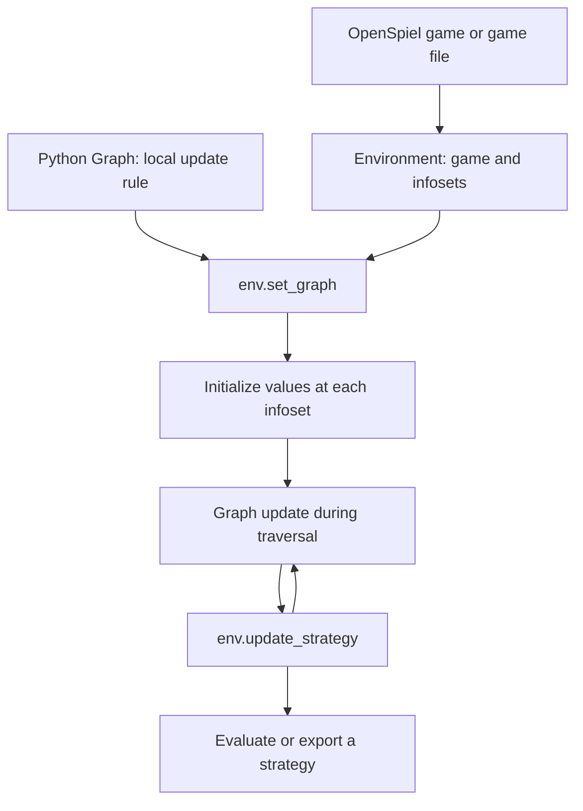

# Core concepts

LiteEFG separates the **game** from the **algorithm**. An environment represents the game tree; a computation graph expresses the algorithm’s local update rule. The C++ engine evaluates that rule at the information sets visited by a traversal.

This page explains the tabular workflow used in the [Counterfactual Regret Minimization (CFR) quick start](./quick-start.md).
For networks trained on sampled games, see [Deep learning with JAX](./deep-learning.md).

## Game trees and information sets

An extensive-form game describes decisions, chance events, and terminal payoffs along a tree of histories. An information set (or *infoset*) groups decision nodes a player cannot distinguish. The player uses the same action distribution at every node in that information set.

LiteEFG stores algorithm values per information set. A two-action information set might hold a length-two strategy vector and a length-two regret buffer. Another information set has its own values, even though the same Python graph-node handles describe their roles.

The engine organizes each player’s information sets by the preceding information-set/action pair for that player. This is the structure used for aggregation and sequence-form strategies. Use finite games with a manageable explicit tree and perfect recall; this organization assumes a consistent own-action history for each information set.

## Two different graphs

Python examples use `import LiteEFG as leg`.

| Structure | What it represents | Where you define it |
| --- | --- | --- |
| Game tree and information-set structure | Which decisions follow actions, what players observe, and which payoffs result | An [environment](./environments.md), through OpenSpiel or a game file |
| Computation graph | Vector operations that update the algorithm’s state at an information set | A Python subclass of `leg.Graph` |

The computation graph is an execution description. Operations such as `+`, `dot`, and `normalize` create graph nodes; `aggregate` exchanges values along the information-set structure.

## The graph lifecycle

Create the environment, then construct the complete algorithm graph, and finally attach it with `env.set_graph(graph)`.

Graph construction runs Python code once. Execution later runs the recorded operations in C++. To preserve state across iterations, allocate it in a static context and update it with `inplace` in a dynamic context.

| Phase | When it runs | Typical use |
| --- | --- | --- |
| Static backward | During `set_graph`, from descendants toward ancestors | Initialize strategy/regret buffers; compute subtree-dependent quantities |
| Static forward | During `set_graph`, from ancestors toward descendants | Initialize values that depend on a parent |
| Dynamic backward | During `update`, in reverse traversal order | Aggregate continuation values and update regrets |
| Dynamic forward | During `update`, in traversal order | Propagate information from parent to child |

Within each phase, operations at an information set retain their construction order. **Backward executes before forward.** The [computation graph guide](./computation-graph.md) explains ordering, copying, aggregation, and colors in detail.

## Traversal supplies feedback

The strategy passed to `env.update` determines traversal probabilities and utility feedback. It can differ from the strategy you later record or evaluate; the sampled baselines use this distinction for exploration.

The environment supports three traversal names:

- `Enumerate` visits the full game tree.
- `External` samples chance and opponents’ choices for the updating player while expanding that player’s actions.
- `Outcome` samples a trajectory using the supplied strategies.

The graph must be designed for its feedback estimator. Changing a traversal string does not automatically turn every algorithm into a correct sampled variant. Start with the [algorithm catalog’s choices](./algorithms.md), and select the mode when constructing the environment.

`Graph.utility` supplies local payoff contributions under the traversal. It does not already contain the full continuation value of every action: the CFR graph adds values from subsequent information sets with `aggregate`.

## Behavior and sequence-form strategies

A **behavior strategy** gives an action distribution at each information set. This is what an algorithm’s strategy node stores. A **sequence-form strategy** includes the acting player’s own probability of reaching each action sequence.

`env.update_strategy(strategy)` converts the current behavior strategy into sequence form and records it. LiteEFG averages these sequence-form vectors, then converts back to behavior form when you call `get_strategy`. Averaging the local action probabilities yourself is generally a different operation.

For the sequence-form strategies `x₁, …, xₜ` that you actually record:

| `type_name` | Strategy used |
| --- | --- |
| `"default"` | Current values of the behavior node, converted on demand; no history required |
| `"last-iterate"` | Most recently recorded strategy |
| `"avg-iterate"` | Equal-weight average: `(x₁ + … + xₜ) / t` |
| `"linear-avg-iterate"` | Iteration-weighted average: `2(x₁ + 2x₂ + … + txₜ) / [t(t+1)]` |
| `"best-iterate"` | Recorded profile with the lowest sum of players’ exploitability values; requires `update_best=True` |

The history counter advances on `update_strategy`, not `update`. Recording every tenth iteration averages those recorded strategies. Each graph-node handle has its own history. Best tracking evaluates the whole profile and stores all players’ strategies using that same score; see the [environment reference](environments.md#api-reference).

## Evaluate an experiment

`utility` and `exploitability` on the environment return one number per player. The latter measures how much each player can gain by switching to a best response against the other players’ supplied strategies. For a two-player zero-sum experiment, their sum is a useful convergence measure.

Evaluation uses the full tree even when updates use sampling. Measuring every iteration can dominate runtime on a large game, so the examples evaluate periodically.

The [research references](../research.md) give the theoretical context and assumptions behind the algorithms.
